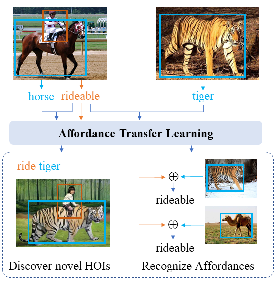

## [Affordance Transfer Learning for Human-Object Interaction Detection](https://arxiv.org/abs/2104.02867)




Here ([HOI-CL-OneStage](https://github.com/zhihou7/HOI-CL-OneStage)) is the Code of VCL and FCL based on One-Stage method.


We notice we can also split V-COCO into 24 verbs. Therefore, we also provides the HOI-COCO with 24 verbs (i.e. both _instr and _obj are kept) 

### 1. Train ATL on HICO-DET
```Shell
python tools/Train_ATL_HICO.py 
```

### 2. Train ATL on HOI-COCO

21 verbs: 

```Shell
python tools/Train_ATL_HOI_COCO_21.py
```

24 verbs:

```Shell
python tools/Train_ATL_HOI_COCO_24.py
```

### 3. Testing

#### HICO-DET


we provide this scripts to test code and eval the ATL on HICO-DET. All models on HICO-DET share this evaluation scripts

    ```Shell
    python scripts/eval.py --model ATL_union_batch1_semi_l2_def4_vloss2_rew2_aug5_3_x5new_coco_res101 --num_iteration 800000
    ```

#### HOI-COCO

21 verbs:

```Shell

python tools/Test_ATL_ResNet_VCOCO_21.py --num_iteration 200000 --model ATL_union_multi_atl_ml5_l05_t5_def2_aug5_new_VCOCO_coco_CL_21
```


24 verbs:

```Shell

python tools/Test_ATL_ResNet_VCOCO_24.py --num_iteration 200000 --model ATL_union_multi_atl_ml5_l05_t5_def2_aug5_new_VCOCO_coco_CL_24
```


### 3. Affordance Recognition

1. extract affordance feature

```Shell
python scripts/affordance/extract_affordance_feature.py --num_iteration 160000 --model ATL_union_multi_atl_ml5_l05_t5_def2_aug5_3_new_VCOCO_test_coco_CL_21

```

2. convert affordance feature to feature bank (select 100 instances for each verb). 
   For V-COCO, it is not necessary since the number of verbs on V-COCO is few. 
```Shell
python scripts/affordance/convert_feats_to_affor_bank_hico.py --model ATL_union_batch1_atl_l2_def4_epoch2_epic2_cosine5_s0_7_vloss2_rew2_aug5_3_x5new_coco_res101 --num_iteration 259638 
```

3. extract object feature
```Shell
python scripts/affordance/extract_obj_feature.py --type gthico --num_iteration 160000 --model ATL_union_multi_atl_ml5_l05_t5_def2_aug5_3_new_VCOCO_test_coco_CL_21
```

The type includes gthico, gtval2017, gtobj365, and gtobj365_coco.

4. obtain hoi prediction
```Shell
python scripts/affordance/obtain_hoi_preds.py --num_iteration 160000 --model ATL_union_multi_atl_ml5_l05_t5_def2_aug5_3_new_VCOCO_test_coco_CL_21 --dataset gthico
```

5. statistic of affordance prediction results.

```Shell
python scripts/affordance/stat_hico_affordance.py gthico ATL_union_batch1_atl_l2_def4_epoch2_epic2_cosine5_s0_7_vloss2_rew2_aug5_3_x5new_coco_res101
```
or
```Shell
python scripts/affordance/stat_vcoco_affordance.py gthico ATL_union_multi_atl_ml5_l05_t5_def2_aug5_3_new_VCOCO_test_coco_CL_21
```

## Citations
If you find this submission is useful for you, please consider citing:

```
@inproceedings{hou2021fcl,
  title={Detecting Human-Object Interaction via Fabricated Compositional Learning},
  author={Hou, Zhi and Baosheng, Yu and Qiao, Yu and Peng, Xiaojiang and Tao, Dacheng},
  booktitle={CVPR},
  year={2021}
}
```

```
@inproceedings{hou2021vcl,
  title={Visual Compositional Learning for Human-Object Interaction Detection},
  author={Hou, Zhi and Peng, Xiaojiang and Qiao, Yu  and Tao, Dacheng},
  booktitle={ECCV},
  year={2020}
}
```

```
@inproceedings{hou2021atl,
  title={Affordance Transfer Learning for Human-Object Interaction Detection},
  author={Hou, Zhi and Baosheng, Yu and Qiao, Yu and Peng, Xiaojiang and Tao, Dacheng},
  booktitle={CVPR},
  year={2021}
}
```

## Acknowledgement

Thanks for all reviewer's comments. That's very valuable for our next work. 
ATL gives a new insight to HOI understanding and in fact inspires a lot to our next work
