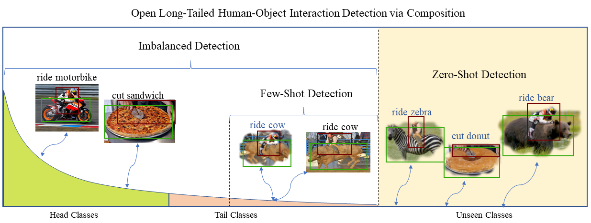

## [Detecting Human-Object Interaction via Fabricated Compositional Learning](https://arxiv.org/abs/2103.08214) (CVPR2021)



Here ([FCL_VCOCO](https://github.com/zhihou7/FCL_VCOCO)) is the Code of FCL on V-COCO

[Here](https://unisydneyedu-my.sharepoint.com/:u:/g/personal/zhou9878_uni_sydney_edu_au/EXOYJZ1N_phJlFW0nTgnABgBuyghLGqVE8C2t5EfiV--xA?e=cXM24T) we provide the code on VRD.


### Train

3. Train Zero-Shot HOI model with FCL on HICO-DET
    ```Shell
    python tools/Train_FCL_HICO.py
    ```
    
### Test

we provide this scripts to test code and eval the FCL results.

    ```Shell
    python scripts/eval.py
    ```

## Citations
If you find this submission is useful for you, please consider citing:

```
@inproceedings{hou2021fcl,
  title={Detecting Human-Object Interaction via Fabricated Compositional Learning},
  author={Hou, Zhi and Baosheng, Yu and Qiao, Yu and Peng, Xiaojiang and Tao, Dacheng},
  booktitle={CVPR},
  year={2021}
}
```

```
@inproceedings{hou2021vcl,
  title={Visual Compositional Learning for Human-Object Interaction Detection},
  author={Hou, Zhi and Peng, Xiaojiang and Qiao, Yu  and Tao, Dacheng},
  booktitle={ECCV},
  year={2020}
}
```

```
@inproceedings{hou2021atl,
  title={Affordance Transfer Learning for Human-Object Interaction Detection},
  author={Hou, Zhi and Baosheng, Yu and Qiao, Yu and Peng, Xiaojiang and Tao, Dacheng},
  booktitle={CVPR},
  year={2021}
}
```