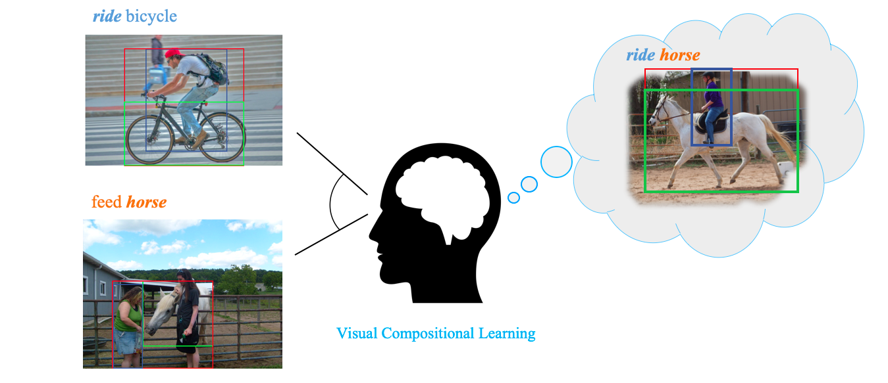

# Visual Compositional Learning for Human-Object Interaction Detection.

Official TensorFlow implementation for VCL ([Visual Compositional Learning for Human-Object Interaction Detection](https://arxiv.org/abs/2007.12407)) in ECCV2020

Welcome to create issues if you have any questions. 




## Citation
If you find our work useful in your research, please consider citing:
```
@article{hou2020visual,
  title={Visual Compositional Learning for Human-Object Interaction Detection},
  author={Hou, Zhi and Peng, Xiaojiang and Qiao, Yu and Tao, Dacheng},
  journal={arXiv preprint arXiv:2007.12407},
  year={2020}
}
```

## Prerequisites

This codebase was developed and tested with Python3.7, Tensorflow 1.14.0, Octave/Matlab (for evaluation), CUDA 10.0 and Ubuntu 18.04.


## Installation
1. Clone the repository. 
    ```Shell
    git clone https://github.com/zhihou7/VCL.git
    ```
2. Download V-COCO and HICO-DET dataset. Setup V-COCO and COCO API. Setup HICO-DET evaluation code.
    ```Shell
    chmod +x ./misc/download_dataset.sh 
    ./misc/download_dataset.sh 
    
    # Assume you cloned the repository to `VCL_DIR'.
    # If you have downloaded V-COCO or HICO-DET dataset somewhere else, you can create a symlink
    # ln -s /path/to/your/v-coco/folder Data/
    # ln -s /path/to/your/hico-det/folder Data/
    ```

## Training
1. Download COCO pre-trained weights and training data
    ```Shell
    chmod +x ./misc/download_training_data.sh 
    ./misc/download_training_data.sh
    ```

3. Train an VCL on HICO-DET
    ```Shell
    python tools/Train_VCL_ResNet_HICO.py --num_iteration 800000
    ```
    
4. Train an VCL for rare first zero-shot on HICO-DET
    ```Shell
    python tools/Train_VCL_ResNet_HICO.py --model VCL_union_multi_zs3_def1_l2_ml5_rew51_aug5_3_x5new --num_iteration 600000
    ```
  
5. Train an VCL for non-rare first zero-shot on HICO-DET
    ```Shell
    python tools/Train_VCL_ResNet_HICO.py --model VCL_union_multi_zs4_def1_l2_ml5_rew51_aug5_3_x5new --num_iteration 400000
    ```

2. Train an VCL on V-COCO
    ```Shell
    python tools/Train_VCL_ResNet_VCOCO.py --model VCL_union_multi_ml1_l05_t3_rew_aug5_3_new_VCOCO_test --num_iteration 400000
    ```

    Here, we design to add the strategies according to model name. 
    For example, in *VCL_union_multi_zs3_def1_l2_ml5_rew51_aug5_3_x5new_res101*, 
    *zs3* means the type of zero-shot, *ml5* is the hyper-parameter for composite branch, 
    *rew* means we use the re-weighting strategy. If you do not use re-weighting, you can remove this in the model name. 
    *aug5_3_x5new* means we set multiple interactions in each batch 
    and the negative and positive samples partition for spatial-human and verb-object branch. *res101* is the backbone while default is res50
    model *VCL_union_multi_base_zs3_def1_l2_ml5_rew51_aug5_3_x5new_res101* is our baseline for the corresponding model 

## Testing
1. Test an VCL on V-COCO
    ```Shell
     python tools/Test_ResNet_VCOCO.py --num_iteration 200000
    ```
3. Test an VCL on HICO-DET
    ```Shell
    python tools/Test_VCL_ResNet_HICO.py --num_iteration 800000
   
    cd Data/ho-rcnn/;python ../../scripts/postprocess_test.py --model VCL_union_multi_ml5_def1_l2_rew2_aug5_3_x5new_res101 --num_iteration 3 --fuse_type spv
    ```
 
    or 
    ```Shell
   python scripts/full_test.py --model VCL_union_multi_ml5_def1_l2_rew2_aug5_3_x5new_res101 --num_iteration 800000
    ```

## Experiment Results

mAP on HICO-DET (Default)


|Model|Full|Rare|Non-Rare|
|:-|:-:|:-:|:-:|
|GPNN [1]|13.11|9.34|14.23|
|iCAN [2]|14.84|10.45|16.15|
|Xu et al.[3]| 14.70|13.26| 15.13|
|TIN [4]|17.22|13.51|18.32|
|Wang et al. [5]|16.24|11.16|17.75|
|No-Frills [6]|17.18|12.17|18.68|
|RPNN [7]| 17.35 | 12.78| 18.71|
|PMFNet [8]|17.46|15.65|18.00|
|Peyre et al. [9] | 19.40|14.63|20.87
|VCL (ours) | **19.43** | **16.55** | 20.29 |
|Bansal*et al.[10]  |  21.96 | 16.43 | 23.62 |
|VCL* (ours) |23.63 | 17.21 | 25.55 |

* means using res101 backbone and fine-tune the object detector on HICO-DET. 

**References:**

[1] Qi, S., et al. Learning Human-Object Interactions by Graph Parsing Neural Networks. ECCV.

[2] Gao, C., et al. iCAN: Instance-Centric Attention Network for Human-Object Interaction Detection. BMVC.

[3] Xu, B., et al Learning to detect human-object  interactions  with  knowledge.  CVPR (2019)
[4] Li, Y. et al. Transferable interactiveness knowledge for human-object interaction detection. CVPR.

[5] Wang, T., et al. Deep contextual attention for human-object interaction detection. ICCV.

[6] Gupta, T., et al. No-frills human-object interaction detection: Factorization, layout encodings, and training techniques. ICCV.

[7] Zhou, P., et al. Relation parsing neural network for human-object interaction detection. ICCV.

[8] Wan, B., et al. Pose-aware multi-level feature network for human object interaction detection. ICCV.

[9] Peyre, J., et al. Detecting unseen visual relations usinganalogies.  ICCV2019

[10] Bansal,  A., et al. Detecting  human-object interactions via functional generalization. AAAI


Zero-shot result


|Model|Full|Rare|Non-Rare|
|:-|:-:|:-:|:-:|
|Shen et al.[1] | 5.62 | - | 6.26 |
|Bansal et al.[2]|10.93|12.60|12.2|
|w/o VCL (rare first)|3.30|18.63|15.56|
|w/o VCL (non-rare first)|5.06|12.77|11.23|
|VCL (rare first)|7.55 | 18.84 | 16.58 | 
|VCL (non-rare first)|9.13 | 13.67 | 12.76 |
|VCL* (rare first)|10.06 | 24.28 | 21.43 | 12.12 | 26.71 | 23.79|
|VCL* (non-rare first)|16.22 | 18.52 | 18.06 | 20.93 | 21.02 | 20.90 |

### Object Detector.
**Noticeably, Detector has an important effect on the performance of HOI detection.**
Our experiment is based on the object detection results provided by iCAN. 
We also fine-tune the detector on HICO-DET train. The detection result on HICO-DET test is 30.79 mAP. 
We provide the object detection result [here](https://drive.google.com/file/d/1QI1kcZJqI-ym6AGQ2swwp4CKb39uLf-4/view?usp=sharing) same as the format of iCAN.

**The performance largely varies based on different detector. It is better to provide the mAP of Detector.**  


**References:**

[1] Shen, L. et al. Scaling human-object inter-action recognition through zero-shot learning

[2] Bansal,  A., et al. Detecting  human-object interactions via functional generalization. AAAI


## TODO

- [x] Code & Data

- [ ] Model, Object Detection Results

- [ ] Test

## Q&A
### 1. The importance of re-weighting strategy.
 
We follow previous work to use re-weighting. 
It multiplies the weights to the logits before the sigmoid function. 
We empirically find this is important for rare and unseen HOI detection

### 2. Res101 Detector. 

The Resnet-101 Detector is fully based on faster-rcnn ([detectron2](https://github.com/facebookresearch/detectron2)).
We fine-tune the [R101-RPN](https://github.com/facebookresearch/detectron2/blob/master/configs/COCO-Detection/faster_rcnn_R_101_FPN_3x.yaml) detector (pretrained on coco) on HICO-DET. 
The detection result on HICO-DET test is 30.79 mAP.
We provide the object detection result [here](https://drive.google.com/file/d/1QI1kcZJqI-ym6AGQ2swwp4CKb39uLf-4/view?usp=sharing) same as the format of iCAN. When using the fine-tuned object detector, you should change the object_thres and humans_thres accordingly (see the test code).
The hico object annotations: [train](https://drive.google.com/file/d/1M4j5-rHcdfHYVfHQToccO0SsEGP4nGC1/view?usp=sharing) and [test](https://drive.google.com/file/d/1qyUURe978WuZRm1s-VWoC_TpTInYTUXd/view?usp=sharing) (coco format)

**Hope the future works who used fine-tuned detector provide the object test mAP.**

### 3. Verb polysemy problem. 

Verb with same name possibly has multiple meaning. For example, fly kite is largely different from fly airplane. 
Similar to previous works [Shen et al, Xu et al, ], We equally treat the verb. 
We also try to solve this problem in VCL with massive attempts (e.g. language priors, RL (search the reasonable pair)). 
However, we do not find any apparent improvement (See our supplementary materials). 

We think there are several reasons: 
1. Most verbs are not polysemy in HICO-DET.
2. Most verbs do not involve multiple objects (only 39). This means there are a few composite HOIs with polysemy problem. 
3. This paper Disambiguating Visual Verbs (TPAMI) also illustrates that HICO dataset do not contain much ambiguated verbs. 

Of course, it is also possible the network could learn the commonness of the same verb. 

We think this problem in HOI understanding require to be further exploited. 

For other relation datasets such as VRD, possibly, 
VCL should take this problem into consideration. 

***Thanks for the reviewer who also points out the problem.***

### 4. VRD
We also evaluate VCL on VRD and we could improve a bit that the baseline based on VTransE.

If you have any questions about this code and the paper, welcome to contact the Zhi Hou (zhou9878 [at] uni dot sydney dot edu dot au).

## Acknowledgement
Codes are built upon [iCAN: Instance-Centric Attention Network 
for Human-Object Interaction Detection](https://arxiv.org/abs/1808.10437), [Transferable Interactiveness Network](https://arxiv.org/abs/1811.08264), [tf-faster-rcnn](https://github.com/endernewton/tf-faster-rcnn).
