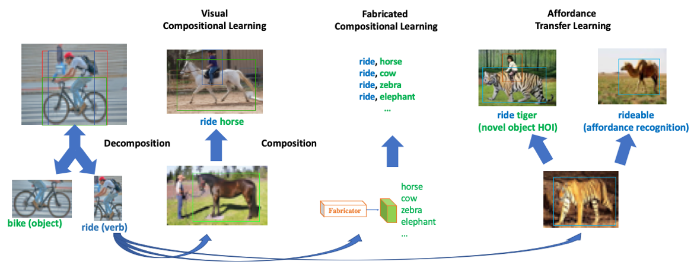

### Compositional Learning for Human-Object Interaction Detection

This repository includes the code of
 
 **[Visual Compositional Learning for Human-Object Interaction Detection](https://arxiv.org/abs/2007.12407) (ECCV2020)**
 
 **[Detecting Human-Object Interaction via Fabricated Compositional Learning](https://arxiv.org/abs/2103.08214) (CVPR2021)**

 **[Affordance Transfer Learning for Human-Object Interaction Detection](https://arxiv.org/abs/2104.02867) (CVPR2021)**





code is being constructed

**If you have any questions, feel free to create issues or contact zhou9878 [at] uni dot sydney dot edu dot au.**


## Prerequisites

This codebase was developed and tested with Python3.7, Tensorflow 1.14.0, Matlab (for evaluation), CUDA 10.0 and Centos 7


## Installation

1. Download HICO-DET dataset. Setup V-COCO and COCO API. Setup HICO-DET evaluation code.
    ```Shell
    chmod +x ./misc/download_dataset.sh 
    ./misc/download_dataset.sh 
    ```

2. Install packages by pip.

    ```
    pip install -r requirements.txt
    ```
   
3. Download COCO pre-trained weights and training data
    ```Shell
    chmod +x ./misc/download_training_data.sh 
    ./misc/download_training_data.sh
    ```
   
   Due to the limitation of space in my google drive, Additional files for ATL are provided in CloudStor.
   

## VCL
See [GETTING_STARTED_VCL.md](GETTING_STARTED_VCL.md). You can also find details in https://github.com/zhihou7/VCL.

## FCL

See [GETTING_STARTED_FCL.md](GETTING_STARTED_FCL.md)

## ATL

See [GETTING_STARTED_ATL.md](GETTING_STARTED_ATL.md). We try to use a HOI model to recognize object affordance, i.e. what actions can be applied to an object.

## Experiment Results


### Long-tailed HOI detection
mAP on HICO-DET (Default)


|Model|Full|Rare|Non-Rare|
|:-|:-:|:-:|:-:|
|VCL|23.63 | 17.21 | 25.55 |
|FCL|24.68 | 20.03 | 26.07|
|VCL+FCL| 25.27| 20.57 |26.67|
|VCL <sup>GT</sup>|43.09 | 32.56| 46.24|
|FCL<sup>GT</sup>|44.26 | 35.46| 46.88|
|(VCL+FCL)<sup>GT</sup>|45.25 | 36.27 | 47.94|

Here, VCL+FCL is the fusion of the two model predictions, which illustrates the complementary between the two lines of work. Table 12 in ATL also illustrates the differences between VCL and FCL. We also tried to directly train the network with the two methods. However, it is worse than the score fusion result.

### Zero-Shot HOI detection

Compositional Zero-Shot

|Model |Unseen|Seen|Full|
|:-|:-:|:-:|:-:|
|VCL(rare first)|10.06 |24.28| 21.43|
|FCL(rare first)|**13.16** |24.23| **22.01**|
|ATL (rare first) | 9.18 | **24.67** | 21.57|
|VCL(non-rare first)|16.22|18.52|18.06|
|FCL(non-rare first)|**18.66**|**19.55**|**19.37**|
|ATL (non-rare first) | 18.25 | 18.78 | 18.67|

Novel Object Zero-Shot

|Model |Unseen|Seen|Full|
|:-|:-:|:-:|:-:|
|ATL (HICO-DET)  | 11.35 | 20.96 | 19.36 |
|FCL  | **15.54** | 20.74 | 19.87|
|ATL (COCO)  | 15.11 | 21.54 | 20.47 |
|ATL (HICO-DET)* | 0.00 | 13.67 | 11.39 |
|FCL* | 0.00 | 13.71 | 11.43|
|ATL (COCO)* |  **5.05** | 14.69 | 13.08|

\* means we remove the object identity information from the detector and only use the boxes.

UC is compositional zero-shot HOI detection. UO means novel object zero-shot HOI detection.

Experimently, FCL achieves better zero-shot performance on compositional zero-shot HOI detection. Under novel object zero-shot HOI detection, ATL is more suitable.

### Object Affordance Recognition
Here, we provides the result reported by AP. 


|Method | HOI Data | Object | Val2017 | Object365 | HICO-DET | Novel classes |
|:-|:-:|:-:|:-:|:-:|:-:|:-:|
|Baseline | HOI | - |      31.91 |  26.16 |     44.00 |      14.27  |
|FCL  | HOI | - |      41.89 |    32.20 |       55.95|   18.84 |
|VCL |  HOI  | HOI|        76.43   |       69.04 |  86.89 |        32.36|
|ATL | HOI  | HOI |   76.52 |       69.27 |     87.20 |   34.20 |
|ATL |  HOI | COCO |     **90.84** | **85.83** | **92.79** |   **36.28**|
||||||||
|Baseline |HICO|- |    19.71 |    17.86 |    23.18 |   6.80 |
|FCL | HICO | - |       25.11    |     25.21 |         37.32 |    6.80 |
|VCL |HICO | HICO |     36.74 |  35.73   |       43.15 |  12.05 |
|ATL  |HICO | HICO|            52.01 |        **50.94**  |    **59.44** |     **15.64**|
|ATL |HICO | COCO|       **56.05** |       40.83 |       57.41 | 8.52 |
||||||||
|ATL<sup>ZS</sup>   |HICO | HICO|      24.21 |       20.88 |     28.56 |       12.26 |
|ATL<sup>ZS</sup> |HICO | COCO |    **35.55** |   **31.77** |   **39.45** |    **13.25** |

## Data & Model
### Data

We present the differences between different detector in our paper and analyze the effect of object boxes on HOI detection. VCL detector and DRG detector can be download from the corresponding paper. Due to the space limitation of Google Drive, there are many files provided in CloudStor. Many thanks to CloudStor and The University of Sydney.
Here, we provide the GT boxes.

GT boxes annotation: https://drive.google.com/file/d/15UXbsoverISJ9wNO-84uI4kQEbRjyRa8/view?usp=sharing

FCL was finished about 10 months ago. In the first submission, we compare the difference among COCO detector, Fine-tuned Detector and GT boxes. We further find DRG object detector largely increases the baseline. 
All these comparisons illustrate the significant effect of object detector on HOI. That's really necessary to provide the performance of object detector.

HOI-COCO training data: https://cloudstor.aarnet.edu.au/plus/s/6NzReMWHblQVpht

Please notice train2017 might contain part of V-COCO test data. Thus, we just use train2014 in our experiment. If we use train2017, the result might be better (improve about 0.5%). We think that is the case: we have localized objects, but we do not know the interaction. 

See [DATA.md](DATA.md) to obtain more test and training data.

### Pre-trained Models
See [MODEL.md](MODEL.md)

## Qustion & Answer
Thanks for all reviewer's comments. 

FCL inspires a lot to combine the object feature from object dataset and verb feature (i.e. ATL on HOI detection). ATL further gives a lot of insight to us in HOI understanding. We are still working on the relationship between HOI understanding and object understanding, the compositionality of HOI. 


### Different Object Detectors
We illustrate the difference between DRG boxes and VCL boxes in Table 16 in FCL. **The recall of FCL with DRG box is nearly similar to GT boxes (62.07 (VCL), 82.81(DRG), 86.08(GT) respectively).**

### Human Box Verb
Following VCL, We extract the verb representation from union box in ATL. However, we find the verb representation (union box vs human box) has an important effect on affordance recognition. Please see https://github.com/zhihou7/HOI-CL/issues/1. Thanks for this issue. We'll update appendix in the version of arxiv.

## Citations
If you find this series of work are useful for you, please consider citing:

```
@inproceedings{hou2021fcl,
  title={Detecting Human-Object Interaction via Fabricated Compositional Learning},
  author={Hou, Zhi and Baosheng, Yu and Qiao, Yu and Peng, Xiaojiang and Tao, Dacheng},
  booktitle={CVPR},
  year={2021}
}
```

```
@inproceedings{hou2021vcl,
  title={Visual Compositional Learning for Human-Object Interaction Detection},
  author={Hou, Zhi and Peng, Xiaojiang and Qiao, Yu  and Tao, Dacheng},
  booktitle={ECCV},
  year={2020}
}
```

```
@inproceedings{hou2021atl,
  title={Affordance Transfer Learning for Human-Object Interaction Detection},
  author={Hou, Zhi and Baosheng, Yu and Qiao, Yu and Peng, Xiaojiang and Tao, Dacheng},
  booktitle={CVPR},
  year={2021}
}
```


## Acknowledgement
Codes are built upon [Visual Compositional Learning for Human-Object Interaction Detection](https://arxiv.org/abs/2007.12407), [iCAN: Instance-Centric Attention Network 
for Human-Object Interaction Detection](https://arxiv.org/abs/1808.10437), [Transferable Interactiveness Network](https://arxiv.org/abs/1811.08264), [tf-faster-rcnn](https://github.com/endernewton/tf-faster-rcnn).

Thanks for all reviewer's comments, e.g. object feature illustration by t-SNE figure, 
which shows the fabricated objects are a bit different from real object features.
